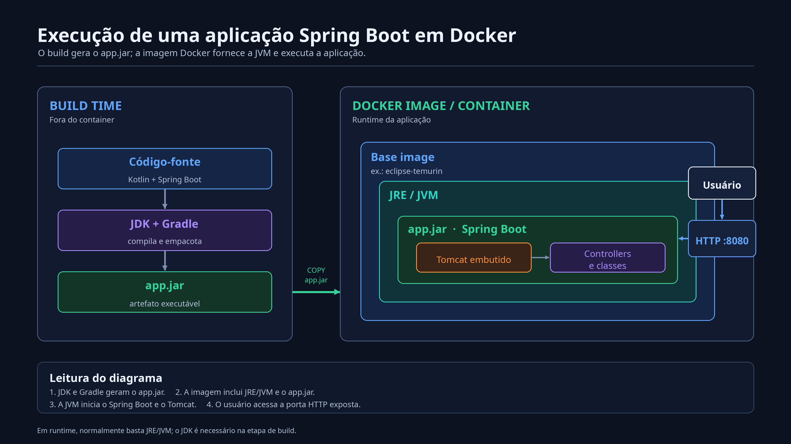

# class-spring

## Como a aplicação é construída e executada



O diagrama apresenta dois momentos diferentes do ciclo de vida da aplicação: o **build time**, quando o código-fonte é transformado em um programa executável, e o **runtime**, quando esse programa está efetivamente rodando dentro de um container Docker.

### 1. Build time

**Build time** é a etapa de construção da aplicação. Nesse momento, o programa ainda não está atendendo requisições de usuários.

#### Código-fonte

O código-fonte é o conjunto de arquivos escritos pelo desenvolvedor. Neste projeto, ele é escrito em **Kotlin** e utiliza o **Spring Boot** para criar a aplicação web.

Arquivos como `Application.kt` e `HelloController.kt` descrevem o comportamento da aplicação, mas não são executados diretamente pelo sistema operacional.

#### JDK

O **JDK**, ou *Java Development Kit*, contém as ferramentas utilizadas no desenvolvimento de aplicações Java e Kotlin. Entre elas está o compilador responsável por transformar o código-fonte em **bytecode**, formato que pode ser entendido pela JVM.

O JDK é necessário principalmente durante o desenvolvimento e o build. Ele não precisa, obrigatoriamente, estar presente na imagem final usada para executar a aplicação.

#### Gradle

O **Gradle** é a ferramenta de automação de build do projeto. As instruções do arquivo `build.gradle` dizem ao Gradle quais dependências baixar, quais plugins utilizar, como compilar o código e qual artefato produzir.

Ao executar:

```bash
./gradlew clean build
```

o Gradle limpa resultados anteriores, compila o projeto, executa as verificações configuradas e gera o arquivo `jar`.

#### O arquivo `app.jar`

O `jar`, abreviação de *Java Archive*, é o artefato executável produzido pelo build. Ele reúne o bytecode da aplicação, metadados e as dependências necessárias para iniciar o Spring Boot.

Em uma aplicação Spring Boot, esse arquivo também inclui o servidor web embutido. Ele pode ser iniciado com um comando semelhante a:

```bash
java -jar app.jar
```

### 2. Runtime no container

**Runtime** é o momento em que o programa está em execução e pode receber requisições. No diagrama, essa execução acontece dentro de um **container Docker**.

#### Docker image

Uma **Docker image** é um pacote imutável usado como modelo para criar containers. Ela reúne o ambiente de execução e os arquivos da aplicação em camadas reproduzíveis.

A imagem não é o processo em execução. Quando ela é iniciada, o Docker cria um **container**, que é a instância executável dessa imagem.

#### Base image

A **base image** é a camada inicial usada para construir a imagem da aplicação. Uma opção comum para projetos Java é `eclipse-temurin`, que fornece uma distribuição do Java adequada para executar o programa.

Usar uma base image padronizada evita depender do Java instalado diretamente na máquina que hospedará a aplicação.

#### JRE e JVM

O **JRE**, ou *Java Runtime Environment*, representa o ambiente necessário para executar programas Java. Seu componente central é a **JVM**, ou *Java Virtual Machine*.

A JVM lê e executa o bytecode contido no `jar`. Essa separação permite que o mesmo artefato seja executado em diferentes sistemas operacionais, desde que exista uma JVM compatível.

Em termos simples:

- o **JDK** é usado para desenvolver e compilar;
- a **JVM** é responsável por executar;
- o ambiente de runtime fornece a JVM e as bibliotecas necessárias durante a execução.

#### Spring Boot

O **Spring Boot** simplifica a configuração e a inicialização de aplicações Spring. Quando a JVM executa o `app.jar`, o método `main` inicia o contexto da aplicação, configura os componentes e prepara o servidor web.

Ele também procura classes como controllers e registra os endpoints definidos por anotações, por exemplo `@RestController` e `@GetMapping`.

#### Tomcat embutido

O **Tomcat** é o servidor web que recebe requisições HTTP e as encaminha para a aplicação. Neste projeto, ele é **embutido**: vem empacotado como dependência do `jar` e é iniciado automaticamente pelo Spring Boot.

Por isso, não é necessário instalar ou configurar um Tomcat externo para executar o projeto.

#### Controllers e classes da aplicação

Os **controllers** definem os pontos de entrada HTTP da aplicação. Quando uma requisição chega ao Tomcat, o Spring identifica qual controller atende à rota solicitada e executa o método correspondente.

As demais classes implementam regras de negócio, acesso a dados e outros comportamentos necessários ao sistema.

#### HTTP e porta 8080

O servidor embutido escuta uma porta de rede, normalmente a **8080**. O container deve publicar essa porta para permitir acesso a partir da máquina hospedeira ou de outros serviços.

O fluxo de uma requisição é:

1. o usuário envia uma requisição HTTP;
2. a requisição chega à porta publicada pelo container;
3. o Tomcat recebe a requisição;
4. o Spring direciona a requisição ao controller correto;
5. a aplicação processa a operação e devolve uma resposta HTTP.

### Resumo do fluxo

O processo completo pode ser entendido assim:

1. o desenvolvedor escreve o código-fonte em Kotlin;
2. o JDK e o Gradle compilam e empacotam o projeto;
3. o build produz um arquivo `jar` executável;
4. o `jar` é copiado para uma Docker image com um runtime Java;
5. um container é criado a partir dessa imagem;
6. a JVM executa o `jar`;
7. o Spring Boot inicia o Tomcat embutido e registra os endpoints;
8. o usuário acessa a aplicação por HTTP na porta publicada.

A separação entre build e runtime torna a entrega mais previsível: o mesmo artefato e o mesmo ambiente podem ser executados em diferentes máquinas sem depender de configurações locais específicas.
